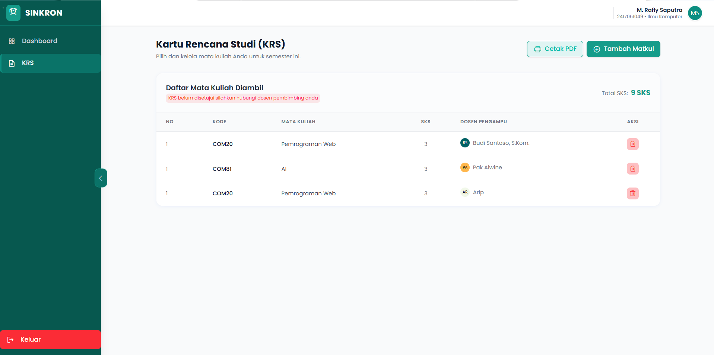
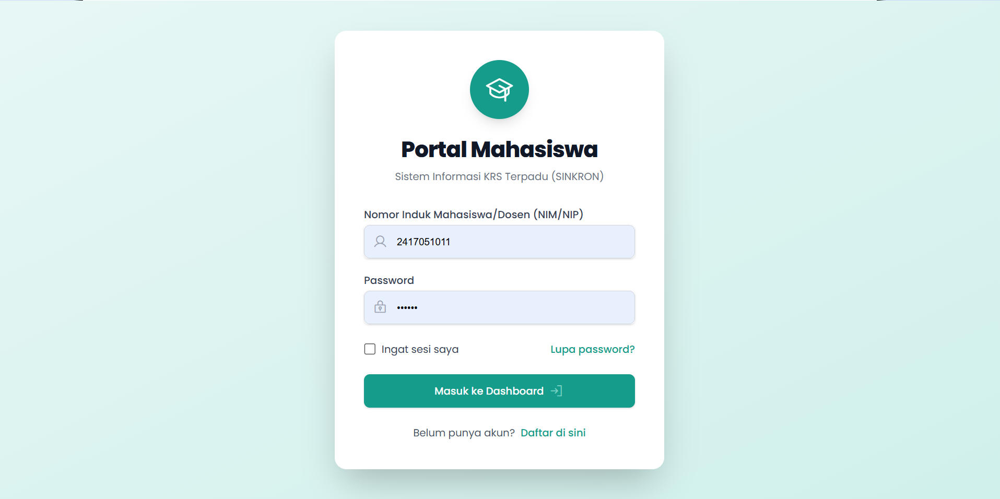
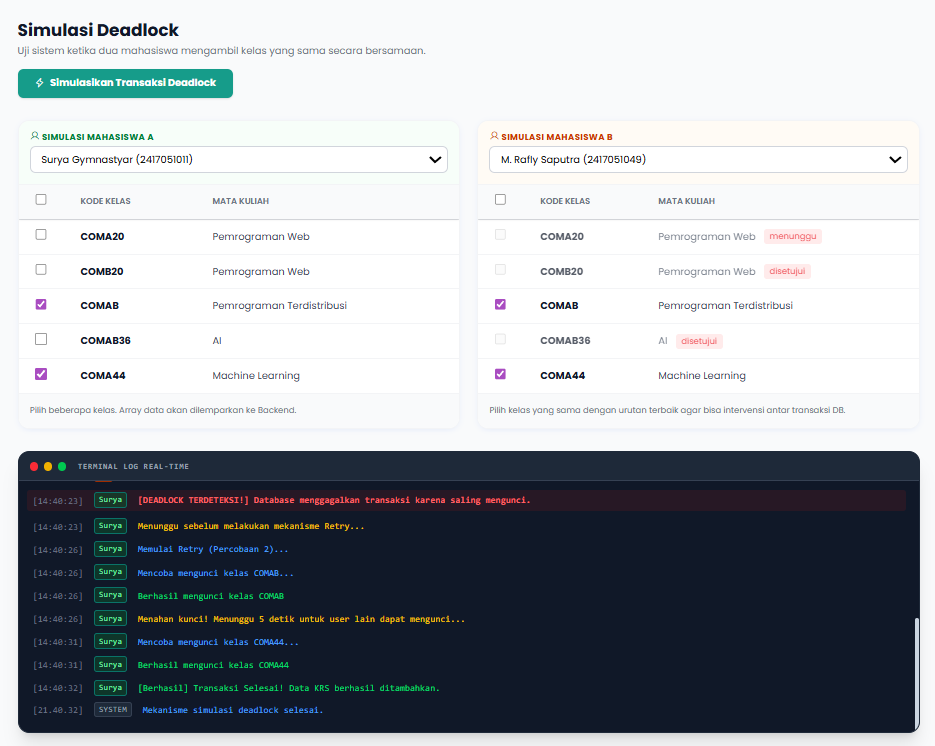

**🚀 SINKRON (Sistem Integrasi Penjadwalan & War KRS Terdistribusi)**

Deskripsi 

SINKRON adalah sistem manajemen akademik berbasis web yang dirancang untuk mengelola data mahasiswa, dosen, KRS, serta memastikan keamanan data melalui fitur sinkronisasi dan backup database otomatis.

<div align="center">
  
</div>


📌 Detail Konsep 

* Fitur Login & Keamanan

  Sistem ini membedakan hak akses antara Admin, Dosen, dan Mahasiswa.

  Cara Kerja: Saat login berhasil, sistem menyimpan identitas pengguna di session. Untuk fitur "Ingat Saya" (Remember Me), sistem menyimpan token terenkripsi di     cookie browser pengguna.

  Keamanan: Password disimpan menggunakan password_hash untuk memastikan keamanan data sensitif.

  <div align="center">
  
</div>

* Join & Set Operations
  
  Kami menggabungkan data dari tabel yang berbeda untuk memberikan informasi lengkap menggunakan INNER JOIN dan LEFT JOIN untuk menghubungkan KRS dengan detail      jadwal mengajar. Selain itu, untuk Set Operations menggunakan UNION untuk menggabungkan data dari berbagai tabel ke dalam satu laporan, memastikan data yang       muncul tidak tumpang tindih.

  SQL

  ```'public function search($data)
    {
        $search = $data['search'];
        $id_user = $data['id_user'];

        try {
            $this->db->query('SELECT 
        m.nim,
        m.nama_lengkap AS nama_mahasiswa,
        mk.id_mk,
        mk.nama_mk,
        mk.sks,
        kls.id_kelas,
        kls.hari,
        kls.jam_mulai,
        kls.jam_selesai,
        kls.ruangan,
        kls.kuota,
        d.nama_lengkap AS nama_dosen,
        COALESCE(k.status, "belum diambil") AS status,
        k.updated_at,
        (
            SELECT COUNT(*) 
            FROM krs k2 
            WHERE k2.id_kelas = kls.id_kelas
        ) AS kuota_terisi,
        (
            kls.kuota - (
                SELECT COUNT(*) 
                FROM krs k3 
                WHERE k3.id_kelas = kls.id_kelas
            )
        ) AS sisa_kuota
    FROM kelas kls
    JOIN matakuliah mk ON kls.id_mk = mk.id_mk
    JOIN dosen d ON kls.id_dosen_koor = d.nip
    JOIN mahasiswa m ON m.nim = :nim
    LEFT JOIN krs k 
        ON k.id_kelas = kls.id_kelas 
        AND k.nim = :nim WHERE mk.nama_mk LIKE :nama_mk');
            $this->db->bind('nim', $id_user);
            $this->db->bind('nama_mk', '%' . $search . '%');
            $this->db->execute();
            return $this->db->resultSet();
        } catch (PDOException $e) {
            echo $e->getMessage();
            return [];
        }
    }```

* Stored Procedure 
  Kami memindahkan logika bisnis dari PHP ke database menggunakan Stored Procedure. Sehingga membuat sistem lebih cepat karena database tidak perlu menunggu         instruksi berulang kali dari aplikasi.
  
  Fungsi: Menjadi "SOP" untuk INSERT, SELECT, UPDATE, dan DELETE.
  
  Manfaat: Memastikan setiap operasi data selalu melalui jalur yang sama, sehingga keamanan dan efisiensi terjamin.

  PHP

  ```public function getMyKrs()
     {
        try {
            $id_user = $_SESSION["id_user"];
            $this->db->query("CALL get_my_krs(:id_user)");
            $this->db->bind("id_user", $id_user);
            $this->db->execute();
            $this->db->closeCursor();
            return $this->db->resultSet();
        } catch (PDOException $e) {
            echo $e->getMessage();
            return false;
        }
    }```

    PHP 

    ```public function hapusKrs($id_kelas)
    {
        try {
            $id_user = $_SESSION["id_user"];
            $this->db->query("CALL hapus_krs(:id_user, :id_kelas, @status)");
            $this->db->bind("id_user", $id_user);
            $this->db->bind("id_kelas", $id_kelas);
            $this->db->execute();

            $this->db->query("SELECT @status as status");
            $this->db->execute();
            $result = $this->db->single();
            return $result["status"];
        } catch (PDOException $e) {
            echo $e->getMessage();
            return false;
        }
    }```

    PHP

    ```public function ambilKrs($id_kelas)
    {
        $id_user = $_SESSION["id_user"];

        $this->db->query("CALL ambil_krs(:id_user, :id_kelas, @status)");
        $this->db->bind("id_user", $id_user);
        $this->db->bind("id_kelas", $id_kelas);
        $this->db->execute();

        $this->db->query("SELECT @status as status");
        $this->db->execute();
        $result = $this->db->single();
        return $result["status"];
    }```

    PHP 

    ```public function edit_kelas($data) {
        $id_kelas = htmlspecialchars($data['id_kelas']);
        $hari = htmlspecialchars($data['hari']);
        $jam_mulai = htmlspecialchars($data['jam_mulai']);
        $jam_selesai = htmlspecialchars($data['jam_selesai']);
        $ruangan = htmlspecialchars($data['ruangan']);
        $kuota = htmlspecialchars($data['kuota']);
        $id_dosen_koor = htmlspecialchars($data['id_dosen_koor']);
        
        $id_dosen_pendamping = isset($data['id_dosen_pendamping']) && $data['id_dosen_pendamping'] !== "" ? htmlspecialchars($data['id_dosen_pendamping']) : null;

        try {
            $this->db->query("CALL update_kelas(:hari, :jam_mulai, :jam_selesai, :ruangan, :kuota, :id_dosen_koor, :id_dosen_pendamping, :id_kelas)");
            $this->db->bind('hari', $hari);
            $this->db->bind('jam_mulai', $jam_mulai);
            $this->db->bind('jam_selesai', $jam_selesai);
            $this->db->bind('ruangan', $ruangan);
            $this->db->bind('kuota', $kuota);
            $this->db->bind('id_dosen_koor', $id_dosen_koor);
            $this->db->bind('id_dosen_pendamping', $id_dosen_pendamping);
            $this->db->bind('id_kelas', $id_kelas);
            $this->db->execute();
            return true;
        } catch(PDOException $e) {
            echo $e->getMessage();
            return false;
        }
    }```


* Database Functions
  
  Kami menggunakan fungsi kustom untuk tugas perhitungan yang sering dipakai.
  
  Custom Function: jumlah_sks(nim) dibuat di database untuk menghitung total SKS mahasiswa secara instan.

  Built-in Function: Menggunakan fungsi standar SQL seperti SUM() untuk total SKS dan COALESCE() untuk menangani nilai null pada tabel KRS.

  FOTO

* Database Views
  
  View digunakan untuk menyederhanakan data. Alih-alih menulis query JOIN yang panjang setiap kali ingin menampilkan kelas, kami mengimplementasikan di              get_semua_kelas yang menggabungkan data kelas, dosen, dan mata kuliah.

  Selain di get_semua_kelas kami juga mengimplementasikan materi views di beberapa bagian berikut :
  
    1\. view_user_akademik : Menggabungkan data mahasiswa dan dosen menggunakan UNION ALL untuk menampilkan daftar seluruh pengguna dalam satu akses data.
  
    2\. get_mk : Menyediakan daftar mata kuliah yang sudah bersih untuk diakses oleh modul manajemen.
  
    3\. getmahasiswadosen : Menggabungkan data rekapitulasi daftar mahasiswa dan dosen untuk tampilan dashboard utama.
  
    4\. get_admin : View khusus untuk menarik statistik data (jumlah mahasiswa, dosen, MK, dan kelas) agar dashboard admin lebih responsif.
  
    5\. get_dosen : View khusus untuk menampilkan profil detail dosen beserta jadwal mengajar secara terpadu.

    SQL

    ```public function getMahasiswaDosen()
    {
        try {
            $this->db->query("SELECT * FROM getmahasiswadosen");
            $this->db->execute();
            return $this->filteredUsers($this->db->resultSet());
        } catch (PDOException $e) {
            echo $e->getMessage();
            return false;
        }
    }```

* Transaction (ACID)
    
  Untuk menjaga agar data tidak korup (misalnya kuota kelas tidak minus), kami menggunakan materi  transaksi.
    
  Cara Kerja: Perintah START TRANSACTION memastikan semua langkah berhasil. Jika ada langkah yang gagal (misal: koneksi terputus saat ambil KRS), perintah           ROLLBACK akan mengembalikan data ke kondisi semula, sehingga data tetap bersih (tidak setengah jadi).

  SQL

  ```public function simulasiDeadlockStream($userNim, $userName, $classes, $userSlot)
    {
        $maxTries = 3;
        $try = 1;

        if ($userSlot == 'B' && count($classes) > 1) {
            $classes = array_reverse($classes);
        }

        $this->emit($userSlot, $userName, "info", "Memulai percobaan transaksi (Percobaan $try)...");

        while ($try <= $maxTries) {
            try {
                $this->db->beginTransaction();
                foreach ($classes as $index => $id_kelas) {
                    $this->emit($userSlot, $userName, "info", "Mencoba mengunci kelas $id_kelas...");

                    $this->db->query("SELECT * FROM kelas WHERE id_kelas = :id FOR UPDATE");
                    $this->db->bind("id", $id_kelas);
                    $this->db->execute();

                    $this->emit($userSlot, $userName, "success", "Berhasil mengunci kelas $id_kelas");
                    
                    $this->db->query("INSERT IGNORE INTO krs (nim, id_kelas) VALUES (:nim, :id_kelas)");
                    $this->db->bind("nim", $userNim);
                    $this->db->bind("id_kelas", $id_kelas);
                    $this->db->execute();

                    if ($index == 0 && count($classes) > 1) {
                        $this->emit($userSlot, $userName, "warning", "Menahan kunci! Menunggu 5 detik untuk user lain dapat mengunci...");
                        sleep(5);
                    }
                }
                
                $this->db->commit();
                $this->emit($userSlot, $userName, "success", "[Berhasil] Transaksi Selesai! Data KRS berhasil ditambahkan.");
                return;
            } catch (PDOException $e) {
                try {
                    $this->db->rollBack();
                } catch (PDOException $err) {
                }

                if (strpos($e->getMessage(), 'Deadlock') !== false || strpos($e->getMessage(), '40001') !== false || strpos($e->getMessage(), '1213') !== false) {
                    $this->emit($userSlot, $userName, "error", "[DEADLOCK TERDETEKSI!] Database menggagalkan transaksi karena saling mengunci.");
                    if ($try < $maxTries) {
                        $this->emit($userSlot, $userName, "warning", "Menunggu sebelum melakukan mekanisme Retry...");
                        sleep(rand(2, 4));
                        $try++;
                        $this->emit($userSlot, $userName, "info", "Memulai Retry (Percobaan $try)...");
                    } else {
                        $this->emit($userSlot, $userName, "error", "[Gagal] Tidak dapat memproses transaksi KRS setelah $maxTries percobaan.");
                        return;
                    }
                } else {
                    $this->emit($userSlot, $userName, "error", "Error DB: " . $e->getMessage());
                    return;
                }
            }
        }
    }```


📌 Detail Konsep UAP

Stored Procedure, Function, dan Trigger bertindak sebagai "SOP internal" yang menetapkan alur eksekusi operasi penting di level database. Dengan menyimpannya langsung di lapisan database, kita menjamin konsistensi, efisiensi, dan keamanan eksekusi data, terutama dalam sistem multi-user.
Berikut adalah beberapa komponen utama yang digunakan:

  * Stored Procedure: ambil_krs
    
    Procedure ini berfungsi sebagai SOP untuk memproses pengambilan KRS mahasiswa. Prosedur ini memastikan bahwa pengecekan kuota dan penambahan data dilakukan        dalam satu transaksi yang aman.

    Fungsi: Menjamin bahwa proses INSERT KRS hanya terjadi jika kuota masih tersedia.
    
    Keamanan: Menghindari race condition karena penguncian data dilakukan di level database (FOR UPDATE).

    

  * Database Function: jumlah_sks
  
    Function ini digunakan untuk menghitung total SKS yang telah diambil oleh seorang mahasiswa. Menggunakan fungsi di level database jauh lebih cepat daripada        menghitung secara manual di sisi PHP.

    Fungsi: Mengembalikan nilai integer total SKS yang sudah diambil.
  
    Kegunaan: Membantu sistem melakukan validasi apakah mahasiswa sudah memenuhi atau melebihi batas SKS.

    SQL

    ```public function jumlahSks()
    {
        try {
            $id_user = $_SESSION["id_user"];
            $this->db->query("select jumlah_sks(:id_user) as jumlah_sks");
            $this->db->bind("id_user", $id_user);
            $this->db->execute();
            $this->db->closeCursor();
            return $this->db->single();
        } catch (PDOException $e) {
            echo $e->getMessage();
            return false;
        }
    }```

    SQL 

    ```public function search($data)
    {
        $search = $data['search'];
        $id_user = $data['id_user'];

        try {
            $this->db->query('SELECT 
        m.nim,
        m.nama_lengkap AS nama_mahasiswa,
        mk.id_mk,
        mk.nama_mk,
        mk.sks,
        kls.id_kelas,
        kls.hari,
        kls.jam_mulai,
        kls.jam_selesai,
        kls.ruangan,
        kls.kuota,
        d.nama_lengkap AS nama_dosen,
        COALESCE(k.status, "belum diambil") AS status,
        k.updated_at,
        (
            SELECT COUNT(*) 
            FROM krs k2 
            WHERE k2.id_kelas = kls.id_kelas
        ) AS kuota_terisi,
        (
            kls.kuota - (
                SELECT COUNT(*) 
                FROM krs k3 
                WHERE k3.id_kelas = kls.id_kelas
            )
        ) AS sisa_kuota
    FROM kelas kls
    JOIN matakuliah mk ON kls.id_mk = mk.id_mk
    JOIN dosen d ON kls.id_dosen_koor = d.nip
    JOIN mahasiswa m ON m.nim = :nim
    LEFT JOIN krs k 
        ON k.id_kelas = kls.id_kelas 
        AND k.nim = :nim WHERE mk.nama_mk LIKE :nama_mk');
            $this->db->bind('nim', $id_user);
            $this->db->bind('nama_mk', '%' . $search . '%');
            $this->db->execute();
            return $this->db->resultSet();
        } catch (PDOException $e) {
            echo $e->getMessage();
            return [];
        }
    }```

  * Database Trigger: trg_update_krs_log
    
    Trigger ini bekerja sebagai "pengawas otomatis" yang berjalan setiap kali ada data baru atau perubahan di tabel KRS.

    * Jika ada data KRS baru yang masuk (insert), sistem mencatat aksi tambah_krs.
    * Jika data KRS dihapus, sistem mencatat aksi hapus_krs.
    
    Tujuan: Menjaga konsistensi data dan mencatat jejak audit (audit trail) tanpa perlu menulis kode INSERT log setiap kali kita memprogram fitur di PHP.

☠️ Simulasi Deadlock

<div align="center">
  
</div>

💾 Backup Database

Untuk menjaga ketersediaan dan keamanan data, sistem ini dilengkapi fitur backup otomatis menggunakan mysqldump dan task scheduler. Backup dilakukan oleh admin dan hasilnya disimpan dengan nama file yang mencakup timestamp, sehingga mudah ditelusuri. Semua file disimpan di direktori storage/backups. Backup dilakukan melalui file backup.php dan hanya dapat diakses oleh pengguna dengan role admin.

📄 app/model/Backup_model.php

```<?php

class Backup_model {
    private Database $db;

    public function __construct() {
        $this->db = new Database(); 
    }

    public function getConfig() {
        $this->db->query("SELECT * FROM konfigurasi_backup LIMIT 1");
        return $this->db->single();
    }

    public function simpanKonfigurasiOtomatis(string $interval) {
        $this->db->query("UPDATE konfigurasi_backup SET mode = 'otomatis', interval_waktu = :interval_waktu, last_backup = NULL WHERE id = :id");
        $this->db->bind('interval_waktu', $interval);
        $this->db->bind('id', 1);
        $this->db->execute();
        return true;
    }

    public function jalankanBackupManual() {
        $host = Constant::DBHOST;
        $user = Constant::DBUSER;
        $pass = Constant::DBPASS;
        $name = Constant::DBNAME;
        
        $namaFile = "backup_" . date('Y-m-d_H-i-s') . ".sql";
        $folderPenyimpanan = dirname(__DIR__, 2) . "/public/backups/";

        if (!file_exists($folderPenyimpanan)) {
            mkdir($folderPenyimpanan, 0777, true);
        }

        $pathPenyimpanan = $folderPenyimpanan . $namaFile;
        
        if ($this->eksekusiBackup($host, $user, $pass, $name, $pathPenyimpanan)) {
            $currentDatetime = date('Y-m-d H:i:s');
            $this->db->query("UPDATE konfigurasi_backup SET mode = 'manual', last_backup = :last_backup WHERE id = 1");
            $this->db->bind('last_backup', $currentDatetime);
            $this->db->execute();
            return true;
        }
        return false;
    }

    public function checkDanJalankanBackupOtomatis() {
        $config = $this->getConfig();
        if (!$config || $config['mode'] !== 'otomatis') {
            return false;
        }

        $interval = $config['interval_waktu'];
        $lastBackup = $config['last_backup'];

        if (empty($lastBackup)) {
            return $this->jalankanBackupOtomatis();
        }

        $lastBackupTime = strtotime($lastBackup);
        $currentTime = time();
        $shouldBackup = false;

        switch ($interval) {
            case 'setiap_jam':
                if ($currentTime - $lastBackupTime >= 3600) {
                    $shouldBackup = true;
                }
                break;
            case 'harian':
                if ($currentTime - $lastBackupTime >= 86400) {
                    $shouldBackup = true;
                }
                break;
            case 'mingguan':
                if ($currentTime - $lastBackupTime >= 604800) {
                    $shouldBackup = true;
                }
                break;
            case 'bulanan':
                if ($currentTime - $lastBackupTime >= 2592000) {
                    $shouldBackup = true;
                }
                break;
        }

        if ($shouldBackup) {
            return $this->jalankanBackupOtomatis();
        }

        return false;
    }

    public function jalankanBackupOtomatis() {
        $currentDatetime = date('Y-m-d H:i:s');
        $this->db->query("UPDATE konfigurasi_backup SET last_backup = :last_backup WHERE id = 1");
        $this->db->bind('last_backup', $currentDatetime);
        $this->db->execute();

        $host = Constant::DBHOST;
        $user = Constant::DBUSER;
        $pass = Constant::DBPASS;
        $name = Constant::DBNAME;
        
        $namaFile = "backup_otomatis_" . date('Y-m-d_H-i-s') . ".sql";
        $folderPenyimpanan = dirname(__DIR__, 2) . "/public/backups/";

        if (!file_exists($folderPenyimpanan)) {
            mkdir($folderPenyimpanan, 0777, true);
        }

        $pathPenyimpanan = $folderPenyimpanan . $namaFile;
        
        return $this->eksekusiBackup($host, $user, $pass, $name, $pathPenyimpanan);
    }

    private function eksekusiBackup($host, $user, $pass, $name, $pathPenyimpanan) {
        $batPath = dirname(__DIR__, 2) . "/mysqlbackup.bat";
        $logPath = dirname(__DIR__, 2) . "/public/backups/backup_error.log";
        $success = false;

        if (file_exists($logPath)) {
            @unlink($logPath);
        }

        if (file_exists($batPath)) {
            $command = "\"{$batPath}\" \"{$user}\" \"{$pass}\" \"{$host}\" \"{$name}\" \"{$pathPenyimpanan}\" 2>\"{$logPath}\"";
            system($command, $output);
            if ($output === 0) {
                $success = true;
                if (file_exists($logPath)) @unlink($logPath);
            }
        }

        if (!$success) {
            $command = "mysqldump --user={$user} --password={$pass} --host={$host} {$name} > \"{$pathPenyimpanan}\" 2>\"{$logPath}\"";
            system($command, $output);
            if ($output === 0) {
                $success = true;
                if (file_exists($logPath)) @unlink($logPath);
            }
        }

        if (!$success) {
            if (file_exists($logPath)) @unlink($logPath);
            $success = $this->backupViaPHP($host, $user, $pass, $name, $pathPenyimpanan);
        }

        return $success;
    }

    private function backupViaPHP($host, $user, $pass, $name, $pathPenyimpanan) {
        try {
            $pdo = new PDO(
                "mysql:host={$host};dbname={$name};charset=utf8mb4",
                $user,
                $pass,
                [PDO::ATTR_ERRMODE => PDO::ERRMODE_EXCEPTION]
            );

            $sql  = "-- ========================================\n";
            $sql .= "-- Database Backup: {$name}\n";
            $sql .= "-- Dibuat pada: " . date('Y-m-d H:i:s') . "\n";
            $sql .= "-- Metode: PHP PDO Native\n";
            $sql .= "-- ========================================\n\n";
            $sql .= "SET FOREIGN_KEY_CHECKS=0;\n";
            $sql .= "SET SQL_MODE='NO_AUTO_VALUE_ON_ZERO';\n";
            $sql .= "SET NAMES utf8mb4;\n\n";

            $tabelStmt = $pdo->query("SHOW FULL TABLES WHERE Table_type = 'BASE TABLE'");
            $semuaTabel = $tabelStmt->fetchAll(PDO::FETCH_COLUMN);

            $tabelTerurut = $this->urutkanTabel($pdo, $semuaTabel, $name);

            foreach ($tabelTerurut as $tabel) {
                $createStmt = $pdo->query("SHOW CREATE TABLE `{$tabel}`");
                $createRow  = $createStmt->fetch(PDO::FETCH_ASSOC);
                $createSql  = $createRow['Create Table'];

                $sql .= "-- ------------------------------------------\n";
                $sql .= "-- Tabel: `{$tabel}`\n";
                $sql .= "-- ------------------------------------------\n";
                $sql .= "DROP TABLE IF EXISTS `{$tabel}`;\n";
                $sql .= $createSql . ";\n\n";

                // Data tabel
                $dataStmt = $pdo->query("SELECT * FROM `{$tabel}`");
                $rows = $dataStmt->fetchAll(PDO::FETCH_ASSOC);
                if (!empty($rows)) {
                    $kolom = array_map(fn($k) => "`{$k}`", array_keys($rows[0]));
                    $sql .= "INSERT INTO `{$tabel}` (" . implode(', ', $kolom) . ") VALUES\n";
                    $values = [];
                    foreach ($rows as $row) {
                        $escaped = array_map(function($val) use ($pdo) {
                            if ($val === null) return 'NULL';
                            return $pdo->quote($val);
                        }, $row);
                        $values[] = "(" . implode(', ', $escaped) . ")";
                    }
                    $sql .= implode(",\n", $values) . ";\n\n";
                }
            }

            $viewStmt = $pdo->query("SHOW FULL TABLES WHERE Table_type = 'VIEW'");
            $semuaView = $viewStmt->fetchAll(PDO::FETCH_COLUMN);
            foreach ($semuaView as $view) {
                $createStmt = $pdo->query("SHOW CREATE VIEW `{$view}`");
                $createRow  = $createStmt->fetch(PDO::FETCH_ASSOC);
                $createSql  = $createRow['Create View'];

                $sql .= "-- ------------------------------------------\n";
                $sql .= "-- View: `{$view}`\n";
                $sql .= "-- ------------------------------------------\n";
                $sql .= "DROP VIEW IF EXISTS `{$view}`;\n";
                $sql .= $createSql . ";\n\n";
            }

            $procStmt = $pdo->query("SHOW PROCEDURE STATUS WHERE Db = '{$name}'");
            $procs = $procStmt->fetchAll(PDO::FETCH_ASSOC);
            foreach ($procs as $proc) {
                $procName = $proc['Name'];
                $createStmt = $pdo->query("SHOW CREATE PROCEDURE `{$procName}`");
                $createRow  = $createStmt->fetch(PDO::FETCH_ASSOC);
                $createSql  = $createRow['Create Procedure'];
                $sql .= "-- Procedure: `{$procName}`\n";
                $sql .= "DROP PROCEDURE IF EXISTS `{$procName}`;\n";
                $sql .= "DELIMITER ;;\n{$createSql};;\nDELIMITER ;\n\n";
            }

            $funcStmt = $pdo->query("SHOW FUNCTION STATUS WHERE Db = '{$name}'");
            $funcs = $funcStmt->fetchAll(PDO::FETCH_ASSOC);
            foreach ($funcs as $func) {
                $funcName = $func['Name'];
                $createStmt = $pdo->query("SHOW CREATE FUNCTION `{$funcName}`");
                $createRow  = $createStmt->fetch(PDO::FETCH_ASSOC);
                $createSql  = $createRow['Create Function'];
                $sql .= "-- Function: `{$funcName}`\n";
                $sql .= "DROP FUNCTION IF EXISTS `{$funcName}`;\n";
                $sql .= "DELIMITER ;;\n{$createSql};;\nDELIMITER ;\n\n";
            }

            $triggerStmt = $pdo->query("SHOW TRIGGERS FROM `{$name}`");
            $triggers = $triggerStmt->fetchAll(PDO::FETCH_ASSOC);
            foreach ($triggers as $trigger) {
                $triggerName = $trigger['Trigger'];
                $sql .= "-- Trigger: `{$triggerName}`\n";
                $sql .= "DROP TRIGGER IF EXISTS `{$triggerName}`;\n";
                $sql .= "DELIMITER ;;\n";
                $sql .= "CREATE TRIGGER `{$triggerName}` {$trigger['Timing']} {$trigger['Event']} ON `{$trigger['Table']}` FOR EACH ROW\n";
                $sql .= "{$trigger['Statement']};;\n";
                $sql .= "DELIMITER ;\n\n";
            }

            $sql .= "SET FOREIGN_KEY_CHECKS=1;\n";
            $sql .= "-- ========================================\n";
            $sql .= "-- Backup selesai: " . date('Y-m-d H:i:s') . "\n";
            $sql .= "-- ========================================\n";

            return file_put_contents($pathPenyimpanan, $sql) !== false;

        } catch (Exception $e) {
            $logPath = dirname(__DIR__, 2) . "/public/backups/backup_error.log";
            file_put_contents($logPath, "PHP PDO Backup Error: " . $e->getMessage());
            return false;
        }
    }

    private function urutkanTabel($pdo, $tabelList, $dbName) {
        $dependensi = [];
        foreach ($tabelList as $tabel) {
            $dependensi[$tabel] = [];
        }

        $fkStmt = $pdo->query("
            SELECT TABLE_NAME, REFERENCED_TABLE_NAME
            FROM INFORMATION_SCHEMA.KEY_COLUMN_USAGE
            WHERE TABLE_SCHEMA = '{$dbName}'
              AND REFERENCED_TABLE_NAME IS NOT NULL
        ");
        $fkRows = $fkStmt->fetchAll(PDO::FETCH_ASSOC);
        foreach ($fkRows as $fk) {
            $tabel = $fk['TABLE_NAME'];
            $ref   = $fk['REFERENCED_TABLE_NAME'];
            if (isset($dependensi[$tabel]) && $tabel !== $ref) {
                $dependensi[$tabel][] = $ref;
            }
        }

        $dikunjungi = [];
        $hasil = [];

        $kunjungi = function($node) use (&$kunjungi, &$dikunjungi, &$hasil, $dependensi) {
            if (in_array($node, $dikunjungi)) return;
            $dikunjungi[] = $node;
            foreach ($dependensi[$node] ?? [] as $dep) {
                $kunjungi($dep);
            }
            $hasil[] = $node;
        };

        foreach ($tabelList as $tabel) {
            $kunjungi($tabel);
        }

        return $hasil;
    }
}
```

📄 app/controller/Backup.php

```<?php

class Backup extends Controller {
    
    public function index() {
        Permission::izinLogout();
        if(isset($_SESSION["role"]) && $_SESSION["role"] != "admin") {
            header('location:' . Constant::DIRNAME . 'dashboard');
            exit();
        }

        $data["user"] = $this->model("Dashboard_model")->getMyData();
        $data['config'] = $this->model('Backup_model')->getConfig();
        $data["title"] = "Backup Sistem";
        
        $this->view('templates/header', $data);
        $this->view('templates/aside', $data); 
        $this->view('backup/index', $data);
        $this->view('templates/footer');
    }

    public function proses() {
        if ($_SERVER['REQUEST_METHOD'] == 'POST') {
            $mode = $_POST['mode_backup'];

            if ($mode == 'manual') {
                if ($this->model('Backup_model')->jalankanBackupManual()) {
                    Flasher::setFlash('Berhasil melakukan backup manual', 'success');
                } else {
                    Flasher::setFlash('Gagal melakukan backup manual', 'error');
                }
                header('Location: ' . Constant::DIRNAME . 'backup');
                exit;
            } else {
                $interval = $_POST['interval'];
                if ($this->model('Backup_model')->simpanKonfigurasiOtomatis($interval)) {
                    Flasher::setFlash('Berhasil melakukan backup otomatis', 'success');
                } else {
                    Flasher::setFlash('Gagal melakukan backup otomatis', 'error');
                }
                header('Location: ' . Constant::DIRNAME . 'backup');
                exit;
            }
        }
    }
}
```

📄 app/view/backup/index.php
```<main class="flex-1 overflow-x-hidden overflow-y-auto bg-gray-50 p-4 lg:p-8">
    <div class="max-w-7xl mx-auto" id="printable-krs">
        <div class="mb-8 flex flex-col justify-between items-start gap-4">
            <div>
                <h1 class="text-2xl font-bold text-gray-900">Sinkronisasi & Backup</h1>
                <p class="text-sm text-gray-500 mt-1">Silahkan pilih mode backup dan lakukan sinkronisasi data.</p>
            </div>
        </div>

        <div class="grid grid-cols-1 xl:grid-cols-3 gap-6">

            <div class="xl:col-span-2">
                <div class="bg-white rounded-xl shadow-sm border border-gray-100 p-6">
                    <form action="<?= CONSTANT::DIRNAME; ?>backup/proses" method="POST">

                        <div class="mb-6">
                            <label class="block text-gray-700 font-semibold mb-3">Pilih Mode Pencadangan:</label>

                            <label for="manual"
                                class="block p-4 mb-3 border border-gray-200 rounded-lg cursor-pointer bg-slate-50 hover:bg-slate-100 hover:border-teal-500 transition duration-200">
                                <div class="flex items-start">
                                    <div class="flex items-center h-5">
                                        <input type="radio" name="mode_backup" id="manual" value="manual"
                                            <?= ($data['config']['mode'] ?? 'manual') == 'manual' ? 'checked' : ''; ?>
                                            class="h-4 w-4 text-teal-600 border-gray-300 focus:ring-teal-500">
                                    </div>
                                    <div class="ms-3 text-sm">
                                        <span class="block font-bold text-teal-800"><i class="ph ph-cloud-arrow-up text-lg mr-1"></i> Manual Backup</span>
                                        <span class="block text-gray-500 text-xs mt-0.5">Sistem langsung melakukan
                                            backup data ke dalam folder /public/backups dengan file format .sql.</span>
                                    </div>
                                </div>
                            </label>

                            <label for="otomatis"
                                class="block p-4 border border-gray-200 rounded-lg cursor-pointer bg-slate-50 hover:bg-slate-100 hover:border-teal-500 transition duration-200">
                                <div class="flex items-start">
                                    <div class="flex items-center h-5">
                                        <input type="radio" name="mode_backup" id="otomatis" value="otomatis"
                                            <?= ($data['config']['mode'] ?? '') == 'otomatis' ? 'checked' : ''; ?>
                                            class="h-4 w-4 text-teal-600 border-gray-300 focus:ring-teal-500">
                                    </div>
                                    <div class="ms-3 text-sm">
                                        <span class="block font-bold text-teal-800"><i class="ph ph-timer text-lg mr-1"></i> Backup Otomatis</span>
                                        <span class="block text-gray-500 text-xs mt-0.5">Sistem akan melakukan
                                            penjadwalan backup otomatis di background berdasarkan rentang waktu yang
                                            dipilih.</span>
                                    </div>
                                </div>
                            </label>
                        </div>

                        <div id="input-interval"
                            class="<?= ($data['config']['mode'] ?? '') == 'otomatis' ? '' : 'hidden opacity-0'; ?> mb-6 transition-all duration-300 transform">
                            <label for="interval" class="block text-gray-700 font-semibold mb-2">Pilih Interval
                                Waktu:</label>
                            <select name="interval" id="interval"
                                class="w-full bg-white border border-gray-300 text-gray-700 py-2.5 px-3 rounded-lg focus:outline-none focus:ring-2 focus:ring-teal-500 focus:border-teal-500 text-sm">
                                <option value="setiap_jam" <?= ($data['config']['interval_waktu'] ?? '') == 'setiap_jam' ? 'selected' : ''; ?>>⏰ Setiap Jam</option>
                                <option value="harian" <?= ($data['config']['interval_waktu'] ?? 'harian') == 'harian' ? 'selected' : ''; ?>>📅 Setiap Hari (Tengah Malam)</option>
                                <option value="mingguan" <?= ($data['config']['interval_waktu'] ?? '') == 'mingguan' ? 'selected' : ''; ?>>📆 Setiap Minggu</option>
                                <option value="bulanan" <?= ($data['config']['interval_waktu'] ?? '') == 'bulanan' ? 'selected' : ''; ?>>🗓️ Setiap Bulan</option>
                            </select>
                        </div>

                        <div class="flex justify-end">
                            <button type="submit"
                                class="bg-brand-600 hover:bg-brand-700 text-white font-semibold px-5 py-2.5 rounded-lg shadow-sm transition duration-200 text-sm focus:outline-none focus:ring-2 cursor-pointer focus:ring-offset-2 focus:ring-teal-500">
                                Simpan & Jalankan
                            </button>
                        </div>

                    </form>
                </div>
            </div>

            <div class="xl:col-span-1">
                <div class="bg-teal-50 border border-teal-100 rounded-xl p-5 text-teal-900">
                    <h5 class="font-bold flex items-center mb-2">
                        <i class="ph ph-info text-lg me-2"></i>
                        Informasi Sistem
                    </h5>
                    <p class="text-xs leading-relaxed opacity-90">
                        File hasil backup manual akan langsung diekspor ke dalam folder direktori proyek Anda pada
                        jalur: <br>
                        <code
                            class="bg-white/70 px-1 py-0.5 rounded text-teal-950 font-mono block mt-1 break-all">/public/backups/</code>
                    </p>
                </div>
            </div>

        </div>
    </div>
</main>

<script>
    document.addEventListener("DOMContentLoaded", function () {
        const radioManual = document.getElementById('manual');
        const radioOtomatis = document.getElementById('otomatis');
        const divInterval = document.getElementById('input-interval');

        function toggleInterval() {
            if (radioOtomatis.checked) {
                divInterval.classList.remove('hidden');
                setTimeout(function () {
                    divInterval.classList.remove('opacity-0');
                }, 50);
            } else {
                divInterval.classList.add('opacity-0');
                setTimeout(function () {
                    divInterval.classList.add('hidden');
                }, 300);
            }
        }

        radioManual.addEventListener('change', toggleInterval);
        radioOtomatis.addEventListener('change', toggleInterval);
    });
</script>```
